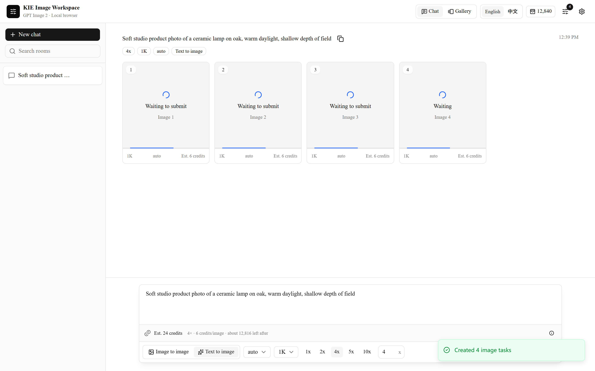

# KIE Image Workspace

A browser-local Next.js interface for generating images with Kie AI and GPT Image 2.



The workspace supports text-to-image, image-to-image, reusable chat rooms, batch
generation from `1x` to `100x`, live task progress, credit estimates, remaining
credit checks, large image previews, and a URL-based gallery.

## Local-First Data

This app is **purely local** to the current browser and website origin:

- The Kie API key is stored in `localStorage` and is sent only when calling Kie.
- Rooms, prompts, task IDs, settings, reference metadata, and result URLs are
  stored in browser storage (IndexedDB / localStorage).
- Generated image files are not copied or persisted by this application. The
  gallery renders the temporary URLs returned by Kie.
- Clearing the browser's site data removes the local workspace. Expired Kie URLs
  cannot be recovered by the application.

## Internationalization

Server-side i18n is enabled with locale-prefixed routes:

- English (default): `/en`
- Chinese: `/zh`

The proxy negotiates locale from the `NEXT_LOCALE` cookie or `Accept-Language`,
then redirects bare paths (for example `/` → `/en`). Dictionaries are loaded on
the server and passed into the client tree.

## Run Locally

```bash
pnpm install
pnpm dev
```

Open [http://localhost:3000](http://localhost:3000), add your own Kie API key in
Settings, and start generating.

For production, set `APP_ORIGIN` to the exact HTTPS origin of the deployment.
